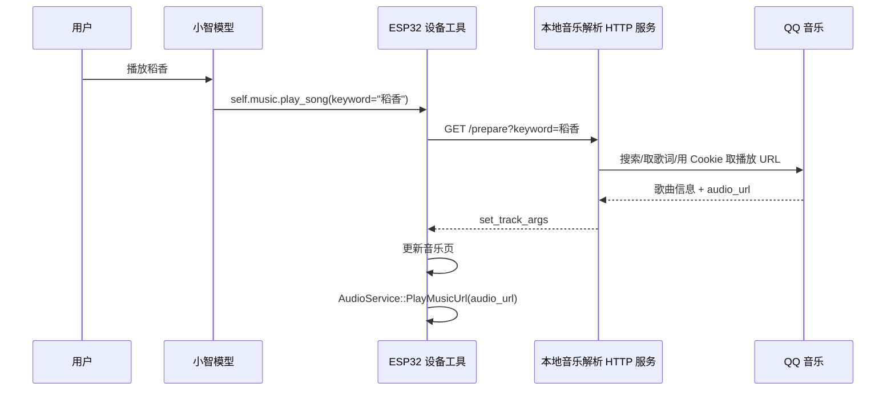

# 音乐播放可靠链路详细设计

## 背景问题

上一版链路是两段式：

1. 小智调用外部 MCP 工具 `prepare_music_card`，在 Mac 上通过 QQ 音乐 Cookie 获取歌曲、歌词、时长和 `audio_url`。
2. 小智必须继续调用设备工具 `self.music.set_track`，ESP32 才会进入音乐页并播放 `audio_url`。

这个设计的问题是第二步依赖模型继续调用另一个工具。实际现象里，小智经常在第一步后直接说“音乐已播放”“稻香已准备”，但没有调用 `self.music.set_track`。这时 MCP 端已经拿到了音源，设备端却完全没有收到播放命令，所以屏幕不跳转、音频不播放。

## 新链路

新链路改成设备端单工具闭环：

关键变化：

- `self.music.play_song` 变成主入口。
- ESP32 自己调用本地 HTTP 解析服务，不再要求模型在 MCP 工具后继续调用 `self.music.set_track`。
- `self.music.set_track` 保留，作为调试和外部直接推送歌曲卡片的兼容工具。
- `prepare_music_card` 保留，HTTP 服务复用它的 QQ 音乐解析、Cookie 和缓存逻辑。

## 组件职责

### ESP32

文件：`main/boards/waveshare/esp32-s3-rlcd-4.2/waveshare-s3-rlcd-4.2.cc`

- `self.music.play_song(keyword)`
  - 先把屏幕切到音乐页，显示“正在准备歌曲”。
  - 请求 `MUSIC_RESOLVER_ENDPOINT`。
  - 解析返回 JSON 中的 `set_track_args`。
  - 调用同一个本地函数更新音乐页。
  - 如果 `audio_url` 非空，停止小智 TTS 并调用 `AudioService::PlayMusicUrl(audio_url)`。

文件：`main/boards/waveshare/esp32-s3-rlcd-4.2/config.h`

- `MUSIC_RESOLVER_ENDPOINT`
  - 开发期为 Mac 局域网地址，例如 `http://192.168.0.101:8765/prepare`。
  - 后期部署公网服务时只需要替换这个地址。

### feifei-mcp

文件：`/Users/zuxingyu/Documents/workspace/hermes/feifei-mcp/tools/music_http_server.py`

- 提供 `GET /prepare?keyword=歌名&index=0`。
- 内部直接调用 `qq_music.prepare_music_card`。
- 返回与 MCP 工具一致的 JSON，包含 `set_track_args`。

文件：`/Users/zuxingyu/Documents/workspace/hermes/feifei-mcp/tools/qq_music.py`

- Cookie 读取优先级为 `cache/qq_music_config.json`、环境变量 `QQ_MUSIC_COOKIE`、`cache/qq_music_cookie.txt`。
- 这样控制台或本地缓存更新 Cookie 后，不会被 `.env` 中的旧 Cookie 覆盖。
- QQ vkey 请求必须逐个 `filename` 请求，不能把多个 `filename` 一次性塞给同一个 `songmid`，否则部分歌曲会拿不到 purl。

文件：`/Users/zuxingyu/Library/LaunchAgents/com.feifei.music-http.plist`

- 让本地音乐 HTTP 服务随登录启动并保持运行。
- 日志写入 `/tmp/feifei_music_http.log`。

## 提示词要求

角色提示词应改为：

- 用户说播放、来一首、听某首歌时，优先调用 `self.music.play_song`。
- `keyword` 填用户说的歌曲名；如果用户说了歌手，可填“歌名 歌手”。
- 不要先调用 `prepare_music_card`，除非是在调试音乐数据。
- 暂停、继续、恢复播放调用 `self.music.toggle_playback`。

## 排查顺序

1. Mac 上检查 HTTP 服务：
   - `curl "http://127.0.0.1:8765/prepare?keyword=稻香"`
   - 返回里应有 `set_track_args.audio_url`。
2. ESP32 访问不通时：
   - 确认 `MUSIC_RESOLVER_ENDPOINT` 是 Mac 的局域网 IP。
   - 确认 Mac 和 ESP32 在同一 Wi-Fi。
   - 查看 `/tmp/feifei_music_http.log` 是否有设备请求。
3. 若有歌词和歌名但无声音：
   - 看 `audio_url` 是否为空。
   - 看串口日志里 `PlayMusicUrl` 是否启动。
4. 若某首歌暂无音源：
   - 先用 HTTP 服务单独查这首歌。
   - 再看 QQ 音乐 Cookie 是否过期或该歌曲账号是否有版权。
