# Waveshare ESP32-S3-RLCD-4.2 启动流程分析

本文基于当前代码实现梳理 `Waveshare ESP32-S3-RLCD-4.2` 的启动链路，便于后续二次开发时快速定位入口、初始化顺序与扩展点。

## 关键入口文件

- `main/main.cc`：ESP-IDF 应用入口，负责初始化 NVS 并启动 `Application`
- `main/application.cc`：应用主控，负责 UI、音频、网络、协议和主事件循环
- `main/boards/common/board.h`：板级单例入口，`Board::GetInstance()` 会触发 `create_board()`
- `main/boards/common/wifi_board.cc`：Wi-Fi 板级公共启动流程，负责联网与配网状态切换
- `main/boards/waveshare/esp32-s3-rlcd-4.2/waveshare-s3-rlcd-4.2.cc`：本板卡的具体实现，负责 I2C、按键、工具、电池和屏幕初始化
- `main/boards/waveshare/esp32-s3-rlcd-4.2/custom_lcd_display.cc`：反射式 LCD 与 LVGL 的对接实现

## 启动主流程

```mermaid
flowchart TD
    A[上电进入 app_main] --> B[初始化 NVS]
    B --> C[Application::GetInstance]
    C --> D[Application::Initialize]
    D --> E[Board::GetInstance]
    E --> F[create_board]
    F --> G[构造 CustomBoard]

    G --> G1[InitializeI2c<br/>初始化音频编解码器 I2C 总线]
    G1 --> G2[InitializeButtons<br/>注册单击/双击按键逻辑]
    G2 --> G3[InitializeTools<br/>注册重新配网 MCP 工具]
    G3 --> G4[InitializeLcdDisplay<br/>创建 CustomLcdDisplay]

    G4 --> H[CustomLcdDisplay 构造]
    H --> H1[初始化 SPI 总线与面板 IO]
    H1 --> H2[配置复位脚]
    H2 --> H3[申请屏幕缓存和像素查找表]
    H3 --> H4[初始化 LVGL 与 display flush 回调]
    H4 --> H5[RLCD_Init 发送面板初始化指令]
    H5 --> I[返回 Application::Initialize]

    I --> J[display->SetupUI]
    J --> K[显示版本信息]
    K --> L[初始化并启动 AudioService]
    L --> M[注册音频事件和状态机监听器]
    M --> N[启动时钟定时器]
    N --> O[注册 MCP 通用工具]
    O --> P[设置网络事件回调]
    P --> Q[board.StartNetwork]

    Q --> R[WifiBoard::StartNetwork]
    R --> S[初始化 WifiManager 并注册回调]
    S --> T{是否已有 SSID}
    T -->|是| U[TryWifiConnect<br/>启动 STA 连接与超时定时器]
    T -->|否| V[延时后进入 StartWifiConfigMode]

    U --> W{是否连接成功}
    W -->|成功| X[触发 MAIN_EVENT_NETWORK_CONNECTED]
    W -->|超时| V
    V --> Y[切换到 WiFi 配网状态]

    X --> Z[HandleNetworkConnectedEvent]
    Z --> AA[切换到 Activating]
    AA --> AB[创建 ActivationTask]
    AB --> AC[检查资源版本]
    AC --> AD[检查固件版本]
    AD --> AE[InitializeProtocol]
    AE --> AF[protocol_->Start]
    AF --> AG[触发 MAIN_EVENT_ACTIVATION_DONE]
    AG --> AH[切换到 Idle]
    AH --> AI[主循环等待按键/唤醒词/网络/协议事件]
```

## 板级构造顺序

`CustomBoard` 构造函数中的顺序固定如下：

1. `InitializeI2c()`
2. `InitializeButtons()`
3. `InitializeTools()`
4. `InitializeLcdDisplay()`

这意味着：

- 音频 codec 依赖的 I2C 总线会最先准备好
- 按键回调在应用真正进入主循环前就已经注册完成
- 屏幕对象会在 `Application::Initialize()` 调用 `board.GetDisplay()` 之前构造完成

## 显示初始化流程

`InitializeLcdDisplay()` 会创建 `CustomLcdDisplay`，其内部又完成以下步骤：

1. 初始化 SPI 总线
2. 创建 `esp_lcd_panel_io_spi`
3. 配置 LCD 复位引脚
4. 分配整屏位图缓存 `DispBuffer`
5. 生成像素坐标到显存字节/位的映射表 `PixelIndexLUT`、`PixelBitLUT`
6. 初始化 LVGL 端口并注册 `Lvgl_flush_cb`
7. 调用 `RLCD_Init()` 向面板发送初始化指令

其中 `Lvgl_flush_cb()` 的职责是：

- 读取 LVGL 输出的 RGB565 像素
- 转换成 RLCD 所需的黑白位图格式
- 写入 `DispBuffer`
- 调用 `RLCD_Display()` 将整屏缓冲发送到屏幕

注意：`SetupUI()` 没有在 `CustomLcdDisplay` 构造函数里执行，而是放在 `Application::Initialize()` 中调用，这是为了保证 LVGL 显示对象与底层面板都已完成初始化后，再去创建具体控件。

## 配网与按键逻辑

按键定义在 `InitializeButtons()`：

- 单击：
  - 若设备还处于 `kDeviceStateStarting`，则进入配网模式
  - 否则执行 `app.ToggleChatState()`，用于开始/停止对话
- 双击：
  - 仅在启用 `CONFIG_USE_DEVICE_AEC` 时生效
  - 设备空闲时切换 AEC 模式

`WifiBoard::StartNetwork()` 的逻辑为：

1. 初始化 `WifiManager`
2. 绑定 Wi-Fi 事件到统一的 `NetworkEvent`
3. 调用 `TryWifiConnect()`

`TryWifiConnect()` 分两种情况：

- 已保存 SSID：启动 STA 连接，并开启 60 秒超时定时器
- 未保存 SSID：延时 1.5 秒后进入配网模式，确保屏幕先显示板卡版本信息

## 联网成功后的动作

当网络连接成功后：

1. `Application::HandleNetworkConnectedEvent()` 将状态切到 `Activating`
2. 创建 `ActivationTask()`
3. 在激活任务中依次执行：
   - `CheckAssetsVersion()`
   - `CheckNewVersion()`
   - `InitializeProtocol()`
4. 初始化协议对象（MQTT 或 WebSocket）
5. 协议启动成功后，设备进入 `Idle`，等待用户交互

## 二次开发建议扩展点

- 若要增加板载外设初始化，优先放在 `CustomBoard` 构造阶段，并注意与 `GetDisplay()` / `GetAudioCodec()` 的调用时序
- 若要修改开机 UI，优先查看 `Application::Initialize()` 与 `display->SetupUI()`
- 若要修改按键行为，直接从 `InitializeButtons()` 入手
- 若要修改配网策略，查看 `WifiBoard::TryWifiConnect()` 与 `WifiBoard::StartWifiConfigMode()`
- 若要修改屏幕刷新格式、局刷策略或刷屏性能，重点查看 `CustomLcdDisplay::Lvgl_flush_cb()`、`RLCD_SetPixel()`、`RLCD_Display()`
